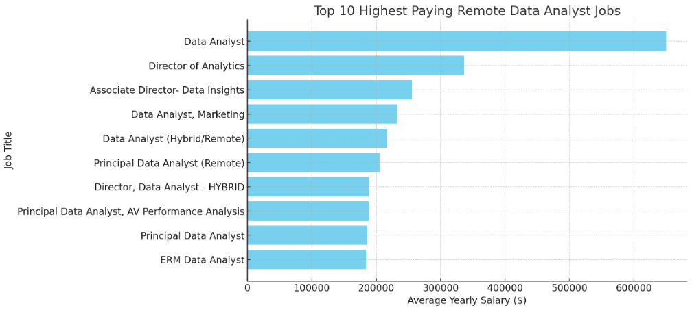
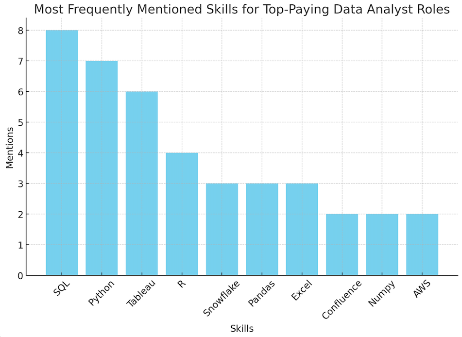
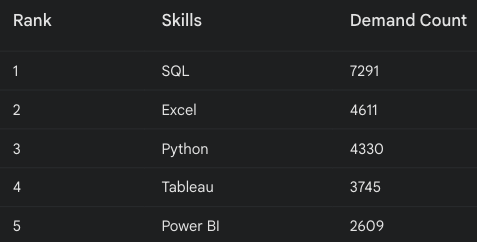
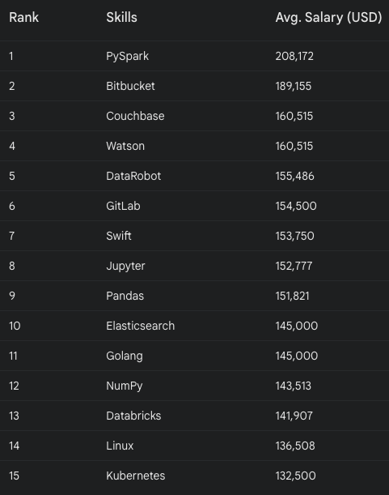
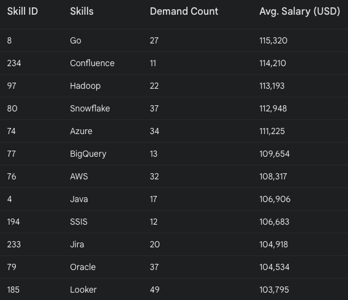

# Introduction
Uncover the landscape of lucrative careers in data analytics. This project investigates high-earning positions, key skills in demand, and the convergence of strong market needs with top-tier salaries in the field.

You can check out the SQL queries here: [project_sql folder](/project_sql/) 

# Background

Fueled by the ambition to better understand the data analyst job market, this project emerged from a desire for identifying top-paying roles and key skills in demand, making it easier not only for me but also for others to discover the best career opportunities.

Data is sourced from [SQL COURSE](https://lukebarousse.com/sql). It offers valuable insights into job titles, salaries, locations, and critical skills.

### This are the questions I wanted to answer through my SQL queries:

1. What are the top-paying data analyst jobs available remotely?
2. What skills are required for these top-paying jobs?
3. What skills are most in demand for data analysts?
4. Which skills are associated with higher salaries?
5. What are the most optimal skills to learn (in high demand and high-paying)?

# Tools I Used

For an in-depth exploration of the data analyst job market, I leveraged several essential tools:

- **SQL:** The core of my analysis, enabling me to query the database and extract vital insights.

- **PostgreSQL:** the chosen database management system for this project, perfect for managing and analyzing job posting data.

- **Visual Studio Code**: the editor for writing and executing SQL queries, as well as managing the database.

- **Git & GitHub**: used for version control and sharing my SQL scripts and findings, ensuring collaboration and tracking throughout the project.

# The Analysis

This project’s queries were built in order to examine various sides of the data analyst job market. Here’s how I answered each question:

### 1. Top paying Data Analyst Jobs available remotely

To pinpoint the top-paying positions, I filtered data analyst roles based on average annual salary and location, with an emphasis on remote opportunities. This query uncovers the most lucrative jobs in the industry.

```sql
SELECT
    job_id,
    job_title,
    job_location,
    job_schedule_type,
    salary_year_avg,
    job_posted_date,
    company_dim.name AS company_name
FROM
    job_postings_fact
    LEFT JOIN company_dim ON 
    job_postings_fact.company_id = company_dim.company_id
WHERE
    salary_year_avg IS NOT NULL AND 
    job_title_short = 'Data Analyst' AND 
    job_work_from_home= TRUE
ORDER BY
    salary_year_avg DESC
LIMIT 10;
```
Here's a concise summary of the top-paying data analyst jobs available remotely:

- **Top Salary:** $650,000 for a "Data Analyst" at Mantys.

- **Senior Roles:** High salaries for "Director of Analytics" at Meta ($336,500)  and "Associate Director- Data Insights" at AT&T ($255,829.5).

- **Specialized Roles:** High pay for "Data Analyst, Marketing" at Pinterest ($232,423).

- **Remote/Hybrid:** All positions offer remote or hybrid options.

- **Salary Range:** $184,000 to $650,000.

- **Key Companies:** Includes major firms like Meta, AT&T, and Pinterest.



*Bar chart visualizing the top 10 highest paying remote data analyst jobs based on the average yearly salary; ChatGPT generated this graph from my SQL query results* 

### 2. Skills for top paying Data Analyst jobs

In order to discover the top paying skills, I joined the job posting facts table with the skills table, allowing me to look into the key qualities employers prioritize for top-paying positions.

```sql
WITH top_paying_jobs AS (
    SELECT
        job_id,
        job_title,
        salary_year_avg,
        company_dim.name AS company_name
    FROM
        job_postings_fact
        LEFT JOIN company_dim ON 
        job_postings_fact.company_id = company_dim.company_id
    WHERE
        salary_year_avg IS NOT NULL AND 
        job_title_short = 'Data Analyst' AND 
        job_location = 'Anywhere'
    ORDER BY
        salary_year_avg DESC
    LIMIT 10
)

SELECT 
    top_paying_jobs.*,
    skills
FROM 
    top_paying_jobs
INNER JOIN skills_job_dim ON
top_paying_jobs.job_id = skills_job_dim.job_id
INNER JOIN skills_dim ON
skills_job_dim.skill_id = skills_dim.skill_id
ORDER BY
    salary_year_avg DESC
```
Based on the analysis of the skills column, here are some key insights:

**Most Frequently Mentioned Skills:**

-**SQL:** Mentioned 8 times.

-**Python:** Mentioned 7 times.

-**Tableau:** Mentioned 6 times.

**Other Notable Skills:**

-**R:** Mentioned 4 times.

-**Snowflake, Pandas, Excel:** Each mentioned 3 times.

-**Confluence, Numpy, AWS:** Each mentioned 2 times.



*This bar chart displays the most frequently mentioned skills for top-paying Data Analyst roles; ChatGPT generated this graph from my SQL query results*

### 3. Top demanded skills for Data Analyst Jobs

This data-driven approach pinpointed the most coveted skills, equipping job seekers with actionable insights.

```sql
SELECT
    skills,
    COUNT (skills_job_dim.job_id) AS demand_count
FROM job_postings_fact
INNER JOIN skills_job_dim ON
job_postings_fact.job_id = skills_job_dim.job_id
INNER JOIN skills_dim ON
skills_job_dim.skill_id = skills_dim.skill_id
WHERE
    job_title_short = 'Data Analyst' AND
    job_work_from_home = TRUE
GROUP BY
    skills
ORDER BY
    demand_count DESC
LIMIT 5;
```
Based on this data, here are some key insights:

- **SQL Dominates:** SQL, the foundation of database interactions, stands out as the most in-demand skill. This underscores its critical importance in the data field.

- **Data Analysis Powerhouse:** Excel and Python, both versatile tools for data analysis and manipulation, occupy the next spots. This highlights the growing demand for professionals skilled in handling and extracting insights from data.

- **Data Visualization Tools:** Tableau and Power BI, popular choices for creating interactive dashboards and reports, are also in high demand. This reflects the increasing emphasis on data visualization and storytelling.



*Table to quickly identify the top demanded skills for data analyst jobs; Gemini generated this table from my SQL query results**

### 4. Top skills based on salary for Data Analyst Jobs

Uncovers the relationship between skill proficiency and salary levels among Data Analysts, enabling individuals to make informed career decisions.

```sql
SELECT
    skills_dim.skills,
    ROUND (AVG (job_postings_fact.salary_year_avg), 0) AS avg_salary_skill
FROM
    job_postings_fact
    INNER JOIN skills_job_dim ON
    job_postings_fact.job_id = skills_job_dim.job_id
    INNER JOIN skills_dim ON
    skills_job_dim.skill_id = skills_dim.skill_id
WHERE
    salary_year_avg IS NOT NULL AND
    job_title_short = 'Data Analyst' AND
    job_work_from_home = TRUE
GROUP BY
    skills_dim.skills
ORDER BY
    avg_salary_skill DESC
LIMIT 25;
```

**Here is a breakdown of the results for top paying skills for Data Analysts:**

- **Big Data and Cloud Computing:** Skills like PySpark and Databricks are highly paid, reflecting the need for expertise in big data and cloud analytics.

- **Automation and DevOps:** High salaries for Bitbucket, GitLab, Jenkins, and Kubernetes indicate a strong demand for automated and efficient data workflows.

- **Programming and Specialized Tools:** Proficiency in Python, Pandas, Numpy, and specialized tools like Couchbase and DataRobot command high salaries, highlighting the value of diverse technical skills.



*Table of the highest average salaries for the top 15 most lucrative skills for data analysts; Gemini generated this table from my SQL query results*

### 5. Te most optimal skills to learn (high demand and high paying) as a Data Analyst

This query focuses on skills that provide job stability (high demand) and substantial earnings (high salaries), delivering valuable guidance for advancing a career in data analysis.

```sql
SELECT
    skills_dim.skill_id,
    skills_dim.skills,
    COUNT (skills_job_dim.job_id) AS demand_count,
    ROUND (AVG(job_postings_fact.salary_year_avg), 0) AS avg_salary
FROM
    job_postings_fact
    INNER JOIN skills_job_dim ON
    job_postings_fact.job_id = skills_job_dim.job_id
    INNER JOIN skills_dim ON
    skills_job_dim.skill_id = skills_dim.skill_id
WHERE
    job_title_short = 'Data Analyst' AND 
    job_work_from_home = TRUE AND 
    salary_year_avg IS NOT NULL
GROUP BY
    skills_dim.skill_id
HAVING
    COUNT (skills_job_dim.job_id) > 10
ORDER BY
    avg_salary DESC,
    demand_count DESC
LIMIT 25;
```
**Key insights based on this query:**

- **High Demand but Moderate Pay:** Skills like Python and Tableau are in high demand but offer moderate salaries (~$101k).

- **Specialized Skills Offer Higher Pay:** Less common skills like Go, Confluence, and Hadoop command higher salaries (up to $115k), despite lower demand.

- **Cloud and Big Data:** Technologies like Snowflake, Azure, and AWS are crucial, offering strong salaries ($99k-$113k) and are vital in modern data analysis.



*Table of the top 12 optimal skills for data analysts; Gemini generated this table from my SQL query results*

# Conclusions
### Insights

1. **Top-Paying Remote Data Analyst Jobs:**

Top-paying remote data analyst jobs offer $184,000 to $650,000, with senior roles at Meta and AT&T, and specialized positions at Pinterest leading the market.

2. **Skills for Top-Paying Data Analyst Jobs:**

Top skills for high-paying roles include SQL, Python, and Tableau, with R, Snowflake, and AWS also valuable.

3. **Top-Demanded Skills for Data Analysts:**

SQL is the most in-demand skill, followed by Excel, Python, and data visualization tools like Tableau and Power BI.

4. **Top-Paying Skills for Data Analysts:**

High salaries are linked to expertise in big data, cloud computing, and automation tools like PySpark, Databricks, and GitLab.

5. **Optimal Skills for Data Analysts:**

For career growth, it is important to focus on both high-demand skills like Python and specialized, higher-paying ones like Go, Hadoop, and cloud technologies.

### Closing thoughts

This analysis helped me to reveale that data skills remain in high demand, with SQL, Python, and data visualization tools being particularly sought-after. While core skills are essential, specializing in niche areas like big data, cloud technologies, and automation can lead to higher earning potential. To succeed as a data analyst, it's crucial to build a strong foundation, stay updated on industry trends, and network with other professionals in the field.


